# Red Hat® AMQ Streams on RHEL installation guide

[Red Hat® AMQ streams](https://www.redhat.com/en/resources/amq-streams-datasheet) is a massively scalable, distributed, and high-performance data streaming platform based on the [Apache Kafka](https://kafka.apache.org/) project.

This guide will show you how to set up a [Red Hat® AMQ Streams cluster](cluster-diagram.png) that's composed of 3 Kafka brokers and 3 Zookeeper nodes. So it requires 6 physical/VM servers in total. However, more servers can be added if needed.

This guide already provides completed ready-to-use configuration files according to the requirements specified in the [cluster diagram](cluster-diagram.png). However, the configurations can be updated based on your requirements too. Please look at [AMQ Streams documentation](https://access.redhat.com/documentation/en-us/red_hat_amq/2021.q3/html/using_amq_streams_on_rhel/index) for more details.

**_Note:_** This installation guide is tested with Red Hat® AMQ Streams 1.8 and Red Hat® Enterprise Linux 7.

This guide consists of following sections:

- [Red Hat® AMQ Streams on RHEL installation guide](#red-hat-amq-streams-on-rhel-installation-guide)
  - [Prerequisites](#prerequisites)
  - [SSL/TLS generator](#ssltls-generator)
  - [Installation steps](#installation-steps)
    - [Common installation steps](#common-installation-steps)
    - [Zookeeper nodes installation steps](#zookeeper-nodes-installation-steps)
    - [Kafka brokers installation steps](#kafka-brokers-installation-steps)
  - [Post-installation](#post-installation)
    - [Cluster logs checking](#cluster-logs-checking)
    - [Authentication and Authorization](#authentication-and-authorization)
    - [Authentication enhancement](#authentication-enhancement)
    - [Functional testing](#functional-testing)
    - [Performance testing](#performance-testing)
    - [Monitoring with Prometheus & Grafana](#monitoring-with-prometheus--grafana)
      - [JMX Exporter](#jmx-exporter)
      - [Kafka Exporter](#kafka-exporter)
      - [Setup Prometheus & Grafana on RHEL](#setup-prometheus--grafana-on-rhel)
    - [Alerting](#alerting)
      - [Configure Prometheus](#configure-prometheus)
      - [Configure Alertmanager](#configure-alertmanager)
      - [Setup verification](#setup-verification)
      - [Testing the alerts](#testing-the-alerts)

---

## Prerequisites

1. JDK - JDK needs to be installed on all servers. Use this command to install Open JDK.

   ```sh
    sudo yum install java-11-openjdk-devel --disablerepo=rhel
   ```

   **_Note:_** The version of JDK can be changed upon your requirement.

2. Local DNS - required for all servers in the cluster to be able to lookup each other using a hostname or a fully qualified domain name (FQDN). Entries need to be added to the `/etc/hosts` file on each server. For example:

   ```txt
   192.168.3.40    kafka1.example.com kafka1
   192.168.3.41    kafka2.example.com kafka2
   192.168.3.42    kafka3.example.com kafka3

   192.168.3.43    zookeeper1.example.com zookeeper1
   192.168.3.44    zookeeper2.example.com zookeeper2
   192.168.3.45    zookeeper3.example.com zookeeper3
   ```

   **_Note:_** IP address, hostname, and domain name of your servers in the cluster will be differernt.

3. SSL/TLS - required for SSL/TLS connection encryption (and maybe Mutual TLS/2 Way SSL if needed). The [SSL/TLS Generator script](ssl-generator.sh) can be used to generate all stuff for SSL/TLS setup e.g. truststore, keystore etc. Look at [SSL/TLS generator](#ssltls-generator) section for how to use the generator script.

---

## SSL/TLS generator

The [SSL/TLS Generator script](ssl-generator.sh) is a script used to generate required components for [Public Key Infrastructure](https://en.wikipedia.org/wiki/Public_key_infrastructure) which will be used for security settings for your cluster, basically, the [SSL/TLS](https://en.wikipedia.org/wiki/Transport_Layer_Security) encryption.

The script will setup a [Certificate Authority](https://en.wikipedia.org/wiki/Certificate_authority) (CA) and generate CA's [root certificate](https://en.wikipedia.org/wiki/Root_certificate) and CA's private key and a truststore files. The CA's certificate will be added to the truststore and CA' private key will be used to sign the [public key certificate](https://en.wikipedia.org/wiki/Public_key_certificate) for all servers in the cluster (and maybe client as well if Mutual TLS/2 Way SSL is required).

The [truststore](https://www.baeldung.com/java-keystore-truststore-difference) file will be used by all servers in the cluster and client(s) who want to connect to the cluster to verify that the secure (SSL/TLS) connection from each other is presenting a valid certificate signed by the trust CA. Also, the script will generate [keystore](https://www.baeldung.com/java-keystore-truststore-difference) file contains key pairs (public and private keys) and [public key certificate](https://en.wikipedia.org/wiki/Public_key_certificate) signed by the CA. The keystore will be used by all servers (and again, maybe client as well if Mutual TLS/2 Way SSL is required).

The script can be used to generate both [wildcard certificate](https://en.wikipedia.org/wiki/Wildcard_certificate) and regular/standalone certificate with [Subject Alternative Name](https://en.wikipedia.org/wiki/Subject_Alternative_Name) or `SAN` extension. For wildcard certificate, the `SAN` extention will have only `DNS` attribute with a value as the wildcard domain name i.e. `*.example.com`. For regular/standalone certificate, the `SAN` extenstion will have both `DNS` and `IP` attributes where the `DNS` attribute value is the FQDN of each server i.e. `kafka1.example.com` and the `IP` attribute value is the IP address of each server in the cluster.

:exclamation: **`IMPORTANT`** Wildcard certificate generation requires Java **15** onward. See [JDK bug](https://bugs.openjdk.java.net/browse/JDK-8186143) for more details.

:memo: **_Note:_** This installation guide uses wildcard certificate for TLS/SSL settings.

All certificates generated by the script are valid for **3650** days. And default password for both keystore and truststore is **`secret@Password!`**. You can change following variable values in the script if need. And if you do, you have to update the `default_days` attribute in the [`openssl-ca.cnf`](openssl-ca.cnf) as well.

```sh
PASSWORD=secret@Password!
VALIDITY_IN_DAYS=3650
```

Following are steps to use the script:

1. Set following environment variables. This information will be used to generate certificates.

   - `COUNTRY` - (2 character country code such as US)
   - `STATE` - (must be spelled out completely such as New York or California)
   - `LOCATION` - Locality/City
   - `ORGANIZATION` - Organization (legal company name)
   - `ORGANIZATION_UNIT` - Organizational Unit (division or department of company
   - `DOMAIN_NAME` - Domain name to which all servers belong. This will be used as CN (The Common Name (CN), also known as the Fully Qualified Domain Name (FQDN)) value and DNS value for SAN extension.

   For example:

   ```sh
   export COUNTRY="TH"
   export STATE="Bangkok"
   export LOCATION="Pathumwan"
   export ORGANIZATION="Red Hat"
   export ORGANIZATION_UNIT="Sale"
   export DOMAIN_NAME="example.com"
   ```

2. Run the script to create all necessary files i.e. truststore, keystore.

   - For **wildcard** certificate generation, run this command.

     ```sh
     ./ssl-generator.sh wildcard
     ```

     The script will generate these files.

     ```sh
     -rw-rw-r--. 1 redhat redhat 2057 Dec 18 17:58 ca.crt
     -rw-rw-r--. 1 redhat redhat 3272 Dec 18 17:58 ca.key
     -rw-rw-r--. 1 redhat redhat 7621 Dec 18 17:58 keystore.jks
     -rw-rw-r--. 1 redhat redhat 1778 Dec 18 17:58 truststore.jks
     ```

   - For **regular/standalone** certificate generation, because a key pairs and public key certificate need to be created individually for each server so the script requires a list of server's host name and IP address. Hence, you have to set a `HOST_IP_LIST` variable with value of a list of hostname (without domain) and IP address pairs in this format: `hostname:ipaddress;hostname:ipaddress;...hostname:ipaddress` before running the script.

     ```sh
     export HOST_IP_LIST="kafka1:192.168.3.40;kafka2:192.168.3.42;zookeeper1:192.168.3.43;zookeeper2:192.168.3.44"
     ./ssl-generator.sh regular
     ```

     The script will generate these files. Please note that the keystore files are prefixed with each hostname need to be used with the server with the same hostname.

     ```sh
     -rw-rw-r--. 1 redhat redhat 2057 Dec 18 17:58 ca.crt
     -rw-rw-r--. 1 redhat redhat 3272 Dec 18 17:58 ca.key
     -rw-rw-r--. 1 redhat redhat 7621 Dec 18 17:58 kafka1.keystore.jks
     -rw-rw-r--. 1 redhat redhat 7621 Dec 18 17:58 kafka2.keystore.jks
     -rw-rw-r--. 1 redhat redhat 7623 Dec 18 17:58 zookeeper1.keystore.jks
     -rw-rw-r--. 1 redhat redhat 7623 Dec 18 17:58 zookeeper2.keystore.jks
     -rw-rw-r--. 1 redhat redhat 1778 Dec 18 17:58 truststore.jks
     ```

     **_Note:_** Only `keystore.jks` and `truststore.jks` are needed for SSL/TLS setup for the cluster. Though, you might need to keep `ca.crt` (CA's certificate) and `ca.key` (CA's private key) in a safe place for signing any new certificate in the future as explained below or you can delete them if not required.

     Apart from that, there might be a situation that new server(s) needs to be added to the cluster to increase capacity of the cluster. If that the case, you can generate new trustore for each new server using following command where `kafka4` is the hostname of the new server.

     ```sh
     ./ssl-generator.sh newhost kafka4 192.168.3.50
     ```

     **_Note:_** You need to export all required environment variables as the step 1 above before running the script.

---

## Installation steps

AMQ Streams installation package (zip file) consits of both Kafka and Zookeeper execute files. So, the setup of Kafka and Zookeeper will be using the same zip file but different configurations.

Installation of AMQ Streams in this guide is seperated into three parts:

1. [Common installation steps](#common-installation-steps) - the steps need to be done on all servers in the cluster.

2. [Zookeeper nodes installation steps](#zookeeper-nodes-installation-steps) - the steps need to be done only on the servers that will be running as Zookeeper nodes.

3. [Kafka brokers installation steps](#kafka-brokers-installation-steps) - the steps need to be done only on the servers that will be running as Kafka brokers.

:exclamation: **`IMPORTANT`** - The setup needs to be done by the `root` user or a user who has equivalent permissions to the `root` user.

---

### Common installation steps

1. Create a new `kafka` user and group for AMQ Streams.

   ```sh
   groupadd kafka
   useradd -g kafka kafka
   passwd kafka
   ```

2. Create a directory to install AMQ streams and a temporary directory.

   ```sh
   mkdir /opt/redhat-amq-streams
   mkdir /tmp/redhat-amq-streams
   ```

3. Upload AMQ sterams zip file to all servers, and extract the zip file to the temporary directory.

   ```sh
   unzip amq-streams-x.y-bin.zip -d /tmp/redhat-amq-streams
   ```

4. Move the extracted contents to `/opt/redhat-amq-streams` directory and delete the temporary directory.

   ```sh
   mv /tmp/redhat-amq-streams/{EXTRACTED-DIRECTORY}/* /opt/redhat-amq-streams/
   rm -r /tmp/redhat-amq-streams
   ```

   **_Note:_** The `{EXTRACTED_DIRECTORY}` is a directory extracted from the zip file e.g. `kafka_2.12-2.8.0.redhat-00002`

5. Upload truststore and keystore files (.jks files) generated from the [SSL/TLS Generator script](ssl-generator.sh) script to `/opt/redhat-amq-streams/config` directory.

---

### Zookeeper nodes installation steps

1. Create a directory for storing Zookeeper data.

   ```sh
   mkdir /var/lib/redhat-amq-streams/zookeeper
   ```

2. Create `myid` file in `/var/lib/redhat-amq-streams/zookeeper` direcotory. Enter the `{ID}` as `1` for the first Zookeeper node, `2` for the second Zookeeper node, and `3` for the third Zookeeper node, and so on.

   ```sh
   echo "{ID}" > /var/lib/redhat-amq-streams/zookeeper/myid
   ```

3. Change the directory's ownership to the `kafka` user and group.

   ```sh
   chown -R kafka:kafka /var/lib/redhat-amq-streams
   ```

4. Backup the original configuration file for Zookeeper.

   ```sh
   mv /opt/redhat-amq-streams/config/zookeeper.properties /opt/redhat-amq-streams/config/zookeeper.properties.origin.bak
   ```

5. Upload [`zookeeper.properties`](zookeeper.properties), [`zookeeper.dynamic.properties`](zookeeper.dynamic.properties) and [`zookeeper-jaas.properties`](zookeeper-jaas.properties) files to `/opt/redhat-amq-streams/config` directory.

6. Update the `zookeeper.dynamic.properties` file in `/opt/redhat-amq-streams/config` directory by replacing the FQDN of the servers that will be running as Zookeeper nodes. For example:

   ```text
   server.1=zookeeper1.example.com:2888:3888:participant;zookeeper1.example.com:2181
   server.2=zookeeper2.example.com:2888:3888:participant;zookeeper2.example.com:2181
   server.3=zookeeper3.example.com:2888:3888:participant;zookeeper3.example.com:2181
   ```

   You need to replace the `zookeeper1.example.com`, `zookeeper2.example.com`, and `zookeeper3.example.com` with the FQDN of your Zookeeper servers.

   If you have more than 3 Zookeeper server/node then you can add more entries by adding `server.{N}=...` where `{N}` is the number of your Zookeeper server e.g. `4, 5, 6,...N` sequentially.

7. Change `/opt/redhat-amq-streams` directory's ownership to the `kafka` user and group.

   ```sh
   chown -R kafka:kafka /opt/redhat-amq-streams
   ```

8. Upload [`zookeeper.service`](zookeeper.service) file to `/etc/systemd/system` directory on server. This will make Zookeeper to be able to start as a system daemon using `systemctl` command.

9. Reload and enable Zookeeper daemon.

   ```sh
   systemctl daemon-reload
   systemctl enable zookeeper
   ```

10. Start Zookeeper as a daemon.

    ```sh
    systtemctl start zookeeper
    ```

11. Make sure that Zookeeper is running.

    ```sh
    jcmd | grep zookeeper
    ```

---

### Kafka brokers installation steps

1. Create a directory for storing Kafka data and set its ownership to the `kafka` user and group.

   ```sh
   mkdir /var/lib/redhat-amq-streams/kafka
   chown -R kafka:kafka /var/lib/redhat-amq-streams
   ```

2. Backup the original configuration file for Kafka.

   ```sh
   mv /opt/redhat-amq-streams/config/server.properties /opt/redhat-amq-streams/config/server.properties.origin.bak
   ```

3. Upload [`server.properties`](server.properties) and [`server-jaas.properties`](server-jaas.properties) files to `/opt/redhat-amq-streams/config` directory.

4. Update the `broker.id={ID}` property in the `server.properties` file in `/opt/redhat-amq-streams/config` directory on server by replacing the `{ID}` starts with `0` for the first Kafka server, `1` for the second Kafka server and `2` for the third Kafka server, and so on. For example:

   ```text
   broker.id=0
   ```

5. Update the `offsets.topic.replication.factor` and `transaction.state.log.replication.factor` property values in the `server.properties` file to be equal to number of Kafka brokers i.e. `3` (depends on the number of Kafka brokers in your cluster) to ensure availability of all partions in `__consumer_offsets` and `__transaction_state` topics in case of some broker is down.

   ```text
   offsets.topic.replication.factor=3
   transaction.state.log.replication.factor=3
   ```

6. Update the `zookeeper.connect` property in the `server.properties` file in `/opt/redhat-amq-streams/config` directory on server by replacing the FQDN of Zookeeper servers within your cluster.

   ```text
   zookeeper.connect=zookeeper1.example.com:2182,zookeeper2.example.com:2182,zookeeper3.example.com:2182
   ```

7. Change `/opt/redhat-amq-streams` directory's ownership to the `kafka` user and group.

   ```sh
   chown -R kafka:kafka /opt/redhat-amq-streams
   ```

8. Upload [`kafka.service`](kafka.service) file to `/etc/systemd/system` directory. This will make Kafka to be able to start as a system daemon using `systemctl` command.

9. Reload and enable Kafka daemon.

   ```sh
   systemctl daemon-reload
   systemctl enable kafka
   ```

10. Start Kafka as a daemon.

    ```sh
    systtemctl start kafka
    ```

11. Make sure that Kafka is running.

    ```sh
    jcmd | grep kafka
    ```

---

## Post-installation

### Cluster logs checking

After installation is done you should check cluster logs to make sure that everything is working fine without any error. To check logs of Kafka and Zookeeper you can uses following commands.

- Check Kafka logs. Run this command on the servers that running as Kafka brokers.

  ```sh
  journalctl -u kafka
  ```

- Check Zookeeper logs. Run this command on the servers that running as Zookeeper nodes.

  ```sh
  journalctl -u zookeeper
  ```

### Authentication and Authorization

The cluster is configured with SASL authentication using JAAS (See: [SASL authentication](https://access.redhat.com/documentation/en-us/red_hat_amq/2021.q3/html/using_amq_streams_on_rhel/configuring_kafka#sasl_authentication) for more details). The [`server-jaas.properties`](server-jaas.properties) file is the JAAS configuration file used by Kafka brokers. The `KafkaServer` section in the [`server-jaas.properties`](server-jaas.properties) is configured with `admin` user i.e. `user_admin="secret@Password!"` which is a super user who has all permissions to perform any activity on brokers such as create topic, delete topic, produce and consume messages etc.

In practice, however, users with limited permissions might need to be created properly. To do so, you can add more users to the `KafkaServer` section based on your requirements. Any new user must be added with this format `user_<username>="<password>"` i.e. `user_kafkaclient="client-secret"`.

:exclamation: **`IMPORTANT`** Please note that any new user added won't be able to perform any operation on broker until authorization is configured for the user.

The cluster is configured with ACL authorization (See: [Simple ACL Authorization](https://access.redhat.com/documentation/en-us/red_hat_amq/2021.q3/html/using_amq_streams_on_rhel/configuring_kafka#con-securing-kafka-authorization-str) for more details.) which is used to define ACL rules or permissions for each user. After adding any new user, you need to define ACL rules for the user accordingly using the `kafka-acls.sh` script in `/opt/redhat-amq-streams/bin` directory. You can use [`client.properties`](client.properties) file which contains necessary configurations for connecting to brokers as a configuration file for the `kafka-acls.sh` script. Please check the link above to see how to use the script to configure ACL rules.

Here is an example of using the `kafka-acls.sh` script with [`client.properties`](client.properties) file to allow `kafkaclient` user to be able to perform all operations i.e. CRUD on the `perf-test` topic.

```sh
./kafka-acls.sh \
  --bootstrap-server kafka1.example.com:9092,kafka2.example.com:9092,kafka3.example.com:9092 \
  --command-config /path/to/client.properties \
  --add \
  --allow-principal User:kafkaclient \
  --operation all \
  --topic perf-test
```

**_Note:_** Please update the `ssl.truststore.location` property in the [`client.properties`](client.properties) file with the correct path of truststore file before use.

### Authentication enhancement

In some situations, SASL authentication with `PLAIN` mechanism could be considered as less secure than the others mechanisms like `SCRAM-SHA-256`, `SCRAM-SHA-512`, `GSSAPI` etc. AMQ Streams can be configured to use more secure mechanisms as mentioned earlier. `SCRAM-SHA-512` mechanisms, for example, can be configured with following steps.

1. Update `sasl.enabled.mechanisms` and `sasl.mechanism.inter.broker.protocol` properties in the `server.properties` file located in `/opt/redhat-amq-streams/config` directory to use `SCRAM-SHA-512` mechanism.

    ```text
    sasl.enabled.mechanisms=SCRAM-SHA-512
    sasl.mechanism.inter.broker.protocol=SCRAM-SHA-512
    ```

    **_Note:_** You can add multiple mechanisms to the `sasl.enabled.mechanisms` property to support multi-mechanisms but `sasl.mechanism.inter.broker.protocol` property can have only one mechanism.

2. Add a new configuration for SCRAM to the `KafkaServer` section in the `server-jaas.properties` file in `/opt/redhat-amq-streams/config` directory.

    ```text
    org.apache.kafka.common.security.scram.ScramLoginModule required
   username="interbroker"
   password="secret"
   user_interbroker="secret"
   user_admin="secret";
    ```

3. User credentials for the SCRAM mechanism are stored in ZooKeeper. The `kafka-configs.sh` tool in `/opt/redhat-amq-streams/bin` can be used to manage them. For example, run the following command to add user user1 with password 123456.

    ```text
    kafka-configs.sh --zookeeper zookeeper1.example.com:2181 --alter --add-config 'SCRAM-SHA-512=[password=123456]' --entity-type users --entity-name user1
    ```

    Then you can add permissions to the user1 as explained in [Authentication and Authorization](#authentication-and-authorization) section.

4. Update [`client.properties`](client.properties) file to use the `SCRAM-SHA-512` instead of `PLAIN`.

    ```text
    sasl.mechanism=SCRAM-SHA-512
    sasl.jaas.config=org.apache.kafka.common.security.scram.ScramLoginModule required username="user1" password="123456";
    ```

### Functional testing

Once you've finished cluster setup and all servers are up and running successfully without any error, you might need to run a few tests to make sure that everything is fine and works properly.

AMQ Streams comes with a bunch of useful scripts that you can use to interact to your cluster via command line including the scripts for performance testing as well.

You can run following commands to verify if basic operations can be performed.

- Create a topic. This command will create a `perf-test` topic with 3 partitions and 3 replications on broker.

  ```sh
  ./kafka-topics.sh --create \
    --bootstrap-server kafka1.example.com:9092,kafka2.example.com:9092,kafka3.example.com:9092 \
    --command-config /path/to/client.properties \
    --replication-factor 3 \
    --partitions 3 \
    --topic perf-test
  ```

- Produce messages to topic. This command can be used to produce message(s) to `perf-test` topic.

  ```sh
  ./kafka-console-producer.sh \
    --bootstrap-server kafka1.example.com:9092,kafka2.example.com:9092,kafka3.example.com:9092 \
    --producer.config /path/to/client.properties \
    --topic perf-test
  ```

- Consume messages from topic. This command will consume all messages from `perf-test` topic from the beginning.

  ```sh
  ./kafka-console-consumer.sh \
    --bootstrap-server kafka1.example.com:9092,kafka2.example.com:9092,kafka3.example.com:9092 \
    --consumer.config /path/to/client.properties \
    --topic perf-test \
    --from-beginning
  ```

See [Apache Kafka CLI commands cheat sheet](https://medium.com/@TimvanBaarsen/apache-kafka-cli-commands-cheat-sheet-a6f06eac01b) for more useful command lines.

### Performance testing

A [performacnce testing](https://medium.com/metrosystemsro/apache-kafka-how-to-test-performance-for-clients-configured-with-ssl-encryption-3356d3a0d52b) might need to be run to verify whether the cluster's performance meets expectation. Following commands can be used to verify producer and consumer performances respectively.

- Test the producer performance. This command will produce 5,000,000 of 2 KB messages to the `perf-test` topic.

  ```sh
  ./kafka-producer-perf-test.sh \
    --topic perf-test \
    --num-records 5000000 \
    --record-size 2000 \
    --throughput -1 \
    --producer.config /path/to/client.properties \
    --producer-props acks=1 bootstrap.servers=kafka1.example.com:9092,kafka2.example.com:9092,kafka3.example.com:9092
  ```

- Test the consumer performance. This command will consume 5,000,000 messages from the `perf-test` topic.

  ```sh
  ./kafka-consumer-perf-test.sh \
    --topic perf-test-1 \
    --messages 5000000 \
    --consumer.config /path/to/client.properties \
    --bootstrap-server kafka1.example.com:9092,kafka2.example.com:9092,kafka3.example.com:9092
  ```

### Monitoring with Prometheus & Grafana

#### JMX Exporter

ZooKeeper, the Kafka broker, Kafka Connect, and the Kafka clients all expose management information using Java Management Extensions (JMX). Most management information is in the form of metrics that are useful for monitoring the condition and performance of your Kafka cluster. Like other Java applications, Kafka provides this management information through managed beans or MBeans.

JMX works at the level of the JVM (Java Virtual Machine). To obtain management information, external tools can connect to the JVM that is running ZooKeeper, the Kafka broker, and so on. By default, only tools on the same machine and running as the same user as the JVM are able to connect.

- Make sure JMX libraries are available in `/opt/redhat-amq-streams/libs` directory.

  Example output.

  ```sh
  [kafka@kafka1 libs]$ pwd
  /opt/redhat-amq-streams/libs
  [kafka@kafka1 libs]$ ll jmx*
  -rw-r--r--. 1 kafka kafka 418608 Jul 27 15:49 jmx_prometheus_javaagent-0.15.0.redhat-00001.jar
  [kafka@kafka1 libs]$
  ```

- Create Prometheus configuration file i.e. [`kafka_broker.yml`](kafka_broker.yml) in `/opt/redhat-amq-streams/config` on servers running as Kafka brokers.

- Create Prometheus configuration file i.e. [`zookeeper.yml`](zookeeper.yml) in `/opt/redhat-amq-streams/config` on servers running as Zookeeper nodes.

- For Kafka broker, edit `/opt/redhat-amq-streams/bin/kafka-server-start.sh` by adding `-javaagent` parameter to JVM via `KAFKA_OPTS` to load JMX agent jar file and [`kafka_broker.yml`](kafka_broker.yml) file in to classpath.

   ```sh
   export KAFKA_OPTS=$KAFKA_OPTS' -javaagent:/opt/redhat-amq-streams/libs/jmx_prometheus_javaagent-0.15.0.redhat-00001.jar=7075:/opt/redhat-amq-streams/config/kafka_broker.yml'

   exec $base_dir/kafka-run-class.sh $EXTRA_ARGS kafka.Kafka "$@"
   ```

   Or you can update `KAFKA_OPTS` in [kafka.service](kafka.service) to include the JMS agent and configuration like this.

   ```txt
   Environment="KAFKA_OPTS=-Djava.security.auth.login.config=/opt/redhat-amq-streams/config/server-jaas.properties -javaagent:/opt/redhat-amq-streams/libs/jmx_prometheus_javaagent-0.15.0.redhat-00001.jar=7075:/opt/redhat-amq-streams/config/kafka_broker.yml"
   ```

- Restart Kafka daemon then check if server is listening on port `7075`.

  For example.

  ```sh
  [kafka@kafka1]$ netstat -tnlp
  ...
  tcp6       0      0 :::7075                 :::*                    LISTEN      16617/java
  ```

- Open <http://kafka1.example.com:7075/metrics> in a web browser or use `curl` command to check if metrics are exposed from the server.

  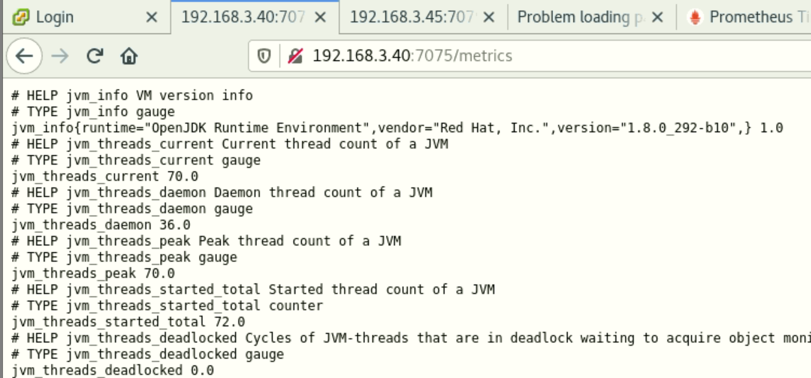

- For Zookeeper broker, edit `/opt/redhat-amq-streams/bin/zookeeper-server-start.sh` by adding `-javaagent` parameter to JVM via `KAFKA_OPTS` to load JMX agent jar file and [`zookeeper.yml`](kafka_broker.yml) file in to classpath.

   ```sh
   export KAFKA_OPTS=$KAFKA_OPTS' -javaagent:/opt/redhat-amq-streams/libs/jmx_prometheus_javaagent-0.15.0.redhat-00001.jar=7075:/opt/redhat-amq-streams/config/zookeeper.yml'

  exec $base_dir/kafka-run-class.sh $EXTRA_ARGS org.apache.zookeeper.server.quorum.QuorumPeerMain "$@"
   ```

   Or you can update `KAFKA_OPTS` in [zookeeper.service](zookeeper.service) to include the JMS agent and configuration like this.

   ```txt
   Environment="KAFKA_OPTS=-Djava.security.auth.login.config=/opt/redhat-amq-streams/config/server-jaas.properties -javaagent:/opt/redhat-amq-streams/libs/jmx_prometheus_javaagent-0.15.0.redhat-00001.jar=7075:/opt/redhat-amq-streams/config/zookeeper.yml"
   ```

- Restart Zookeeper daemon then check if server is listening on port `7075`.

  For example.

  ```sh
  [kafka@zookeeper1]$ netstat -tnlp
  ...
  tcp6       0      0 :::7075                 :::*                    LISTEN      16617/java
  ```

- Open <http://zookeeper1.example.com:7075/metrics> in a web browser or use `curl` command to check if metrics are exposed from the server.

  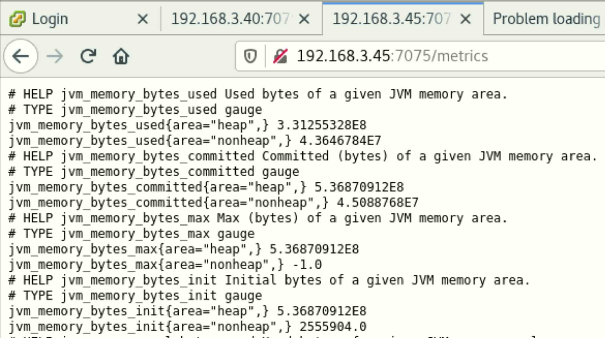

#### Kafka Exporter

Kafka Exporter is an open source project to enhance monitoring of Apache Kafka brokers and clients. Kafka Exporter is provided with AMQ Streams for deployment with a Kafka cluster to extract additional metrics data from Kafka brokers related to offsets, consumer groups, consumer lag, and topics.

The metrics data is used, for example, to help identify slow consumers. Lag data is exposed as Prometheus metrics, which can then be presented in Grafana for analysis.

If you are already using Prometheus and Grafana for monitoring of built-in Kafka metrics, you can configure Prometheus to also scrape the Kafka Exporter Prometheus endpoint using following steps.

- Create kafka exporter [shell script](kafka_exporter.sh) that will be used to run th exporter.

  ```sh
  #!/bin/bash

  /opt/redhat-amq-streams/bin/kafka_exporter \
  --kafka.version="2.8.0" \
  --kafka.server=kafka1.example.com:9092 \
  --kafka.server=kafka2.example.com:9092 \
  --kafka.server=kafka3.example.com:9092 \
  --sasl.enabled=true \
  --sasl.username="admin" \
  --sasl.password="secret@Password!" \
  --sasl.mechanism="PLAIN" \
  --tls.enabled=true \
  --tls.ca-file=ca.crt
  ```

- Create a new system service for Kafka Exporter with contents as a snipet below. And save in `/etc/systemd/system/kafka_exporter.service`

  ```sh
  [Unit]
  Description=Kafka Exporter
  Wants=network-online.target
  After=network-online.target

  [Service]
  User=kafka
  Group=kafka
  Type=simple
  ExecStart=/opt/redhat-amq-streams/bin/kafka_exporter.sh

  [Install]
  WantedBy=multi-user.target
  ```

- Reload, enable, and start kafka_exporter service.

  ```sh
  sudo systemctl daemon-reload
  sudo systemctl enable kafka_exporter
  sudo systemctl start kafka_exporter
  ```

- Open <http://kafka1.example.com:7075/metrics> in a web browser or use `curl` command to check if metrics are exposed from the server.

  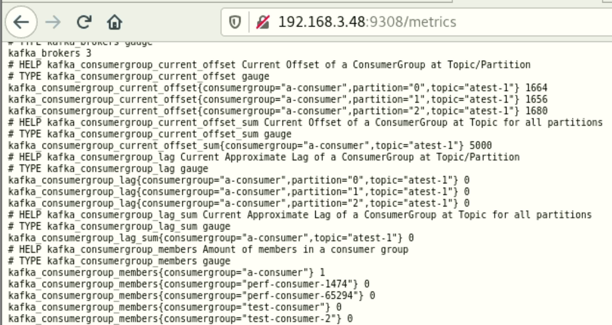

**__Note:__** `kafka_consumergroup_lag` and `kafka_consumergroup_current_offset` metrics will be displayed only if you run consumer client with group name/ID.

#### Setup Prometheus & Grafana on RHEL

- [Install Prometheus on RHEL](https://computingforgeeks.com/how-to-install-prometheus-on-rhel-8/)

- Create or update Prometheus configuration file in `/etc/prometheus/prometheus.yml`, see [prometheus.yml](prometheus.yml) for example.

- Restart Prometheus after create or update the configuration file.

- Verify if kafka-broker, zookeeper & kafka_exporter are available in Prometheus Web UI.

  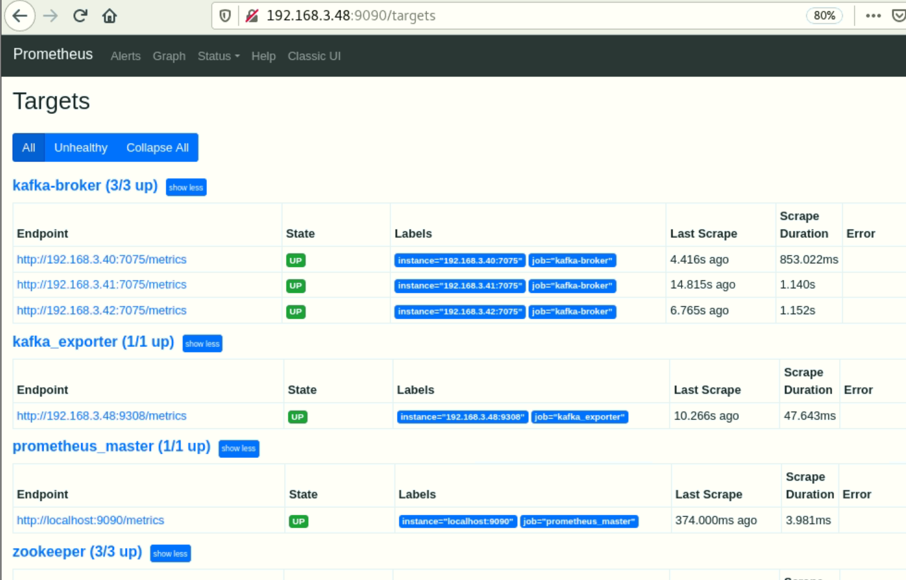

- [Install Grafana on RHEL](https://computingforgeeks.com/how-to-install-grafana-on-rhel-8/)

- Login to Grafana using `admin/admin` as username and password.

- Create a Prometheus datasource.

  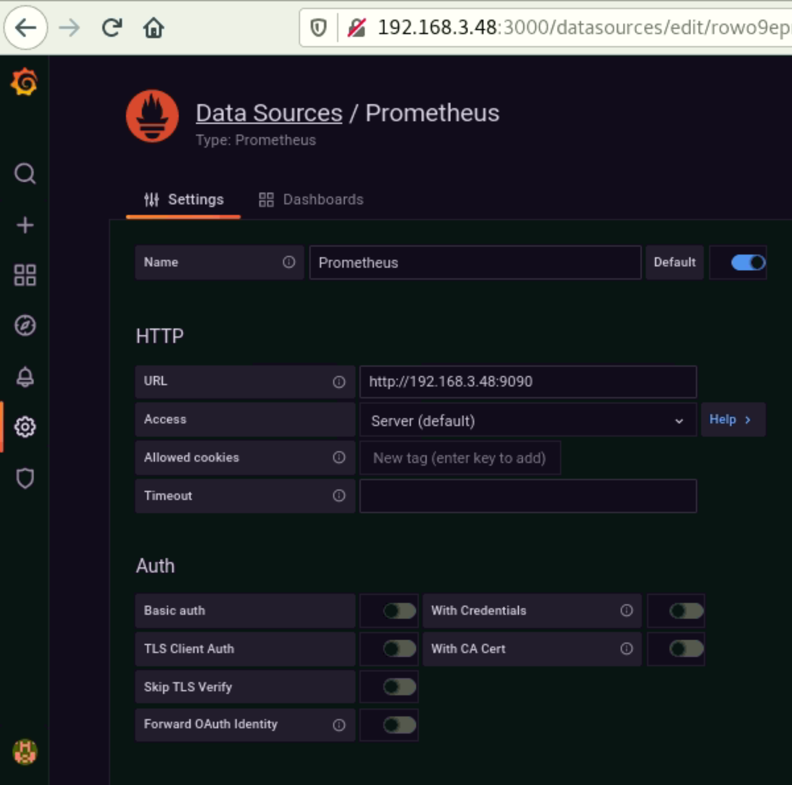

- Import zookeeper-cluster dashboard configuration from [zookeeper-cluster.json](zookeeper-cluster.json) file.

  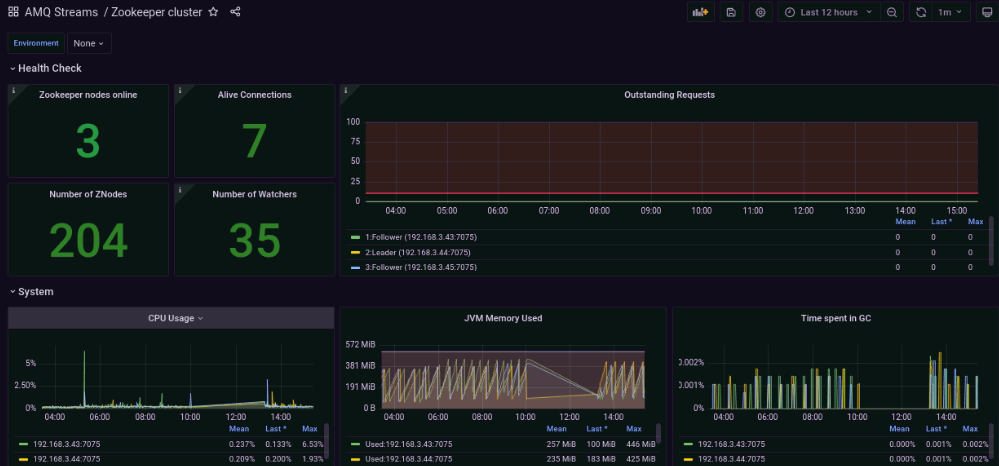

- Import kafka-cluster dashboard configuration from [kafka-cluster.json](kafka-cluster.json) file.
  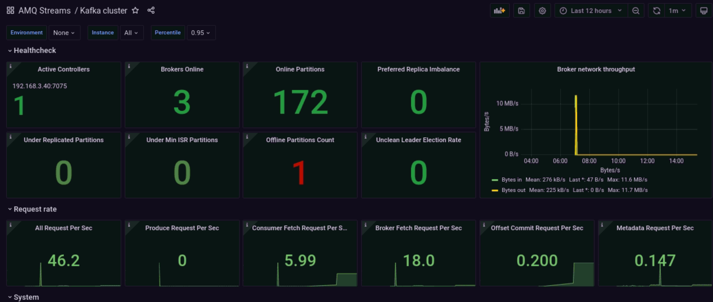

- Import kafka-exporter dashboard configuration from [kafka-exporter.json](kafka-exporter.json) file.

  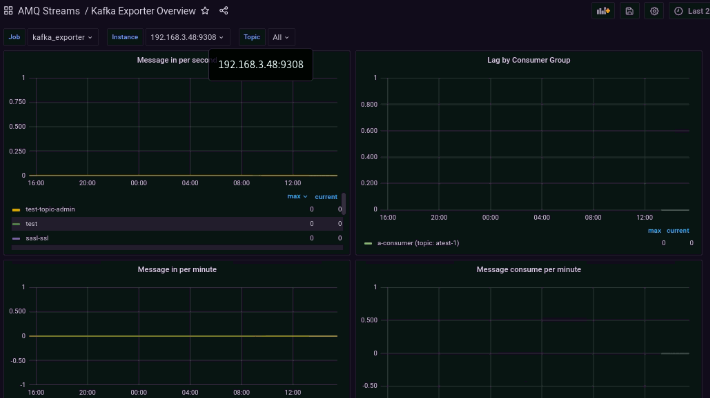

### Alerting

Once you've set up the Prometheus and Grafana in the previous steps, you might need to have some alerts for specific metrics or dashbords to keep track of their status or values when there's something wrong or unexpected then you will be notified by those alerts.

The [Prometheus Alertmanager](https://prometheus.io/docs/alerting/latest/alertmanager/) handles alerts sent by client applications such as the Prometheus server. It takes care of deduplicating, grouping, and routing them to the correct receiver integration such as email, PagerDuty, or OpsGenie. It also takes care of silencing and inhibition of alerts. See this Alertmanager [installation guide](https://acloudxpert.com/install-setup-alertmanager-on-amazon-linux-centos-rhel/) for how to install the Alertmanager on your server.

Setting up alerts with Prometheus is a two-step process; First, create your [alerting rules](https://prometheus.io/docs/prometheus/latest/configuration/alerting_rules/) in Prometheus, Second, you need to [configure](https://prometheus.io/docs/alerting/latest/configuration/) the Alertmanager.

Follwing sections will show you quick steps to complete setting up alerts with Prometheus and this guide already provides configuration files required for setting up alerting rules, and the Alertmanager to send notification via Slack. See this [step-by-step guide](https://grafana.com/blog/2020/02/25/step-by-step-guide-to-setting-up-prometheus-alertmanager-with-slack-pagerduty-and-gmail/) for detailed explaination and other examples.

#### Configure Prometheus

1. Upload [rules.yml](rules.yml) to `/etc/prometheus` directory (default Prometheus configuration directory) on the server where the Prometheus is installed.

2. Update `prometheus.yml` file in `/etc/prometheus` directory.
    - Configure the Alertmanager server where the `<Alertmanager host>` is a hostname/IP address of the server on which the Alertmanager is installed.

      ```text
      alerting:
        alertmanagers:
          - static_configs:
            - targets:
              - <Alertmanager Host>:9093
      ```

    - Confiure the Prometheus to include the rules configuration file.

      ```text
      rule_files:
        - rules.yml
      ```

      *__NOTE:__* You can find some [useful rules here](https://awesome-prometheus-alerts.grep.to/) and you can use built-in Prometheus tool to verify whether the rules are valid or not by running this command: `promtool check rules rules.yml`

3. Restart Prometheus service.

    ```sh
    systemctl restart prometheus
    ```

#### Configure Alertmanager

1. Backup existing configuration file in `/etc/alertmanager` directory (default Alertmanager configuration directory).

   ```sh
   mv prometheus.yml prometheus.yml.backup
   ```

2. As mention above, the guide has provides a configuration file for Alertmanager to send notifications via Slack so you need to update Slack API URL in the [alertmanager.yml](alertmanager.yml) by replacing the `<slack_url>` with your Slack API URL.

3. Upload [alertmanager.yml](alertmanager.yml) file to the `/etc/alertmanager` directory.

4. Restart Alertmanager service.

    ```sh
    systemctl restart alertmanager
    ```

#### Setup verification

After you've completed all steps above, you need to make sure that everything is working fine. Basically, you need to make sure that all the rules configured are loaded to Prometheus, and the Alertmanager is running with valid configurations.

- Check all the rules are loaded by open `http://<prometheus host>:9090/rules` URL in a web browser where the `<prometheus host>` is a hostname/IP on which Prometheus is running. You should be able to see the rules like a screenshot below.

  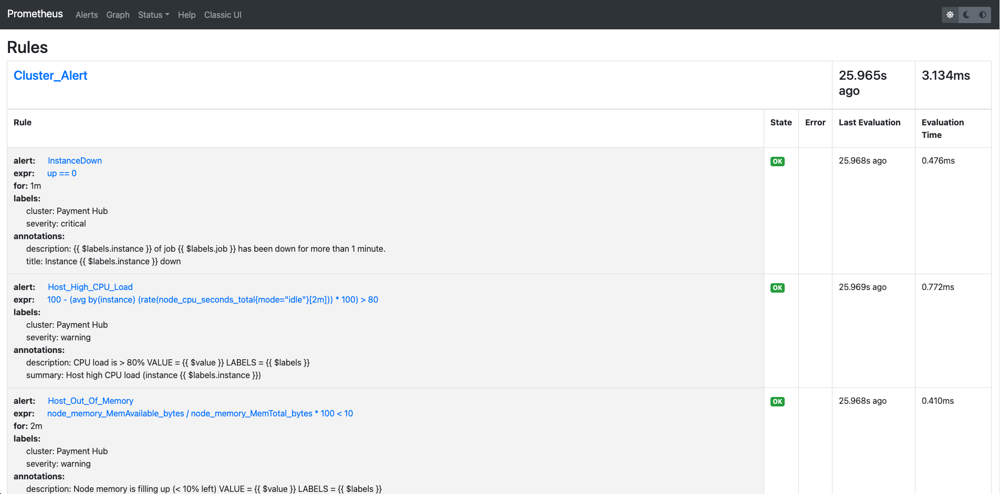

- Verify that Alertmanager is running with valid configurations by open `http://<alertmanager host>:9093/#/status` URL in a web browser where the `<alertmanager host>` is a hostname/IP on which Alertmanager is running. You shoud be able to see the **Config** section like a screenshot below.

  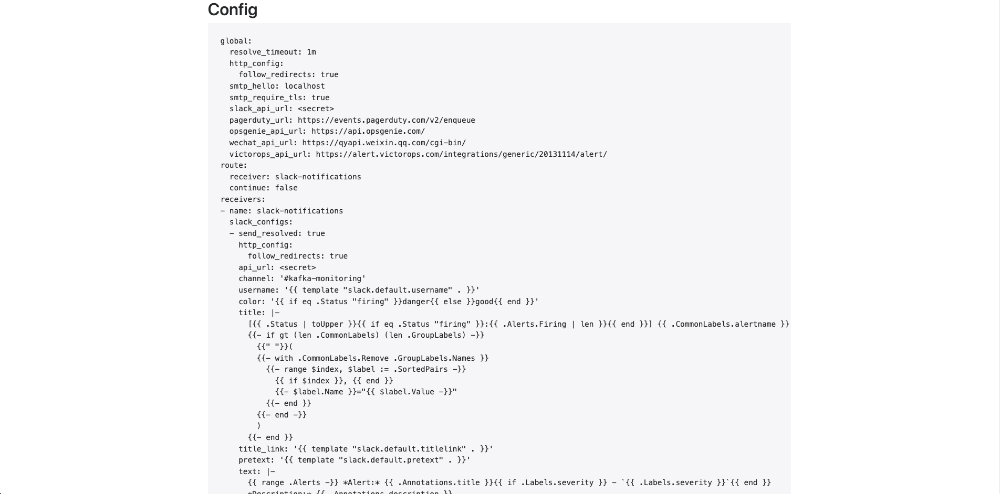

#### Testing the alerts

Testing the alerts depends on how you've configured the alerting rules and where to send notifications to in the Alertmanager config. Following screenshots are example of when one of Kafka brokers is down.

- Alert in Prometheus can be viewed by open `http://<prometheus host>:9090/alerts` URL in a web browser.

  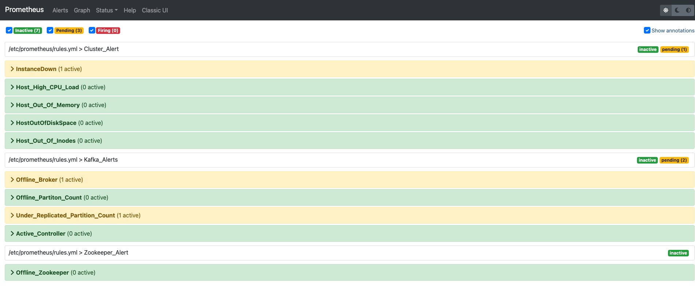

- Alerts in Alertmanager can be viewed by open `http://<alertmanager host>:9093/#/alerts` URL in a web browser.

  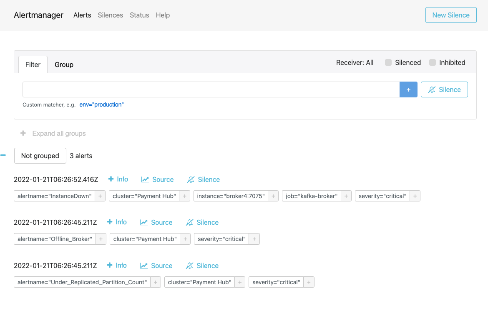

- Slack gets notified with the alert details.

  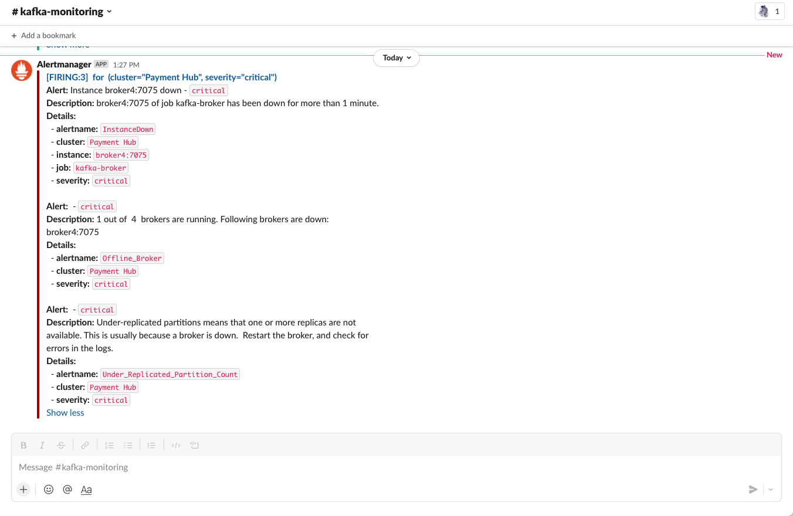
